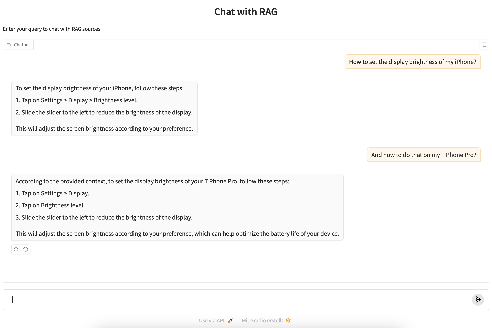

# Colbert Gradio Chatbot

This repository contains a Gradio-based chatbot that uses the ColBERT model for text embedding and Qdrant for vector storage. The chatbot can process PDF documents, split them into chunks, and use them for retrieval-augmented generation (RAG) to answer user queries.

This is a sample screenshot created with the iPhone's ios5 user guide and the T Phone Pro manual in the docs folder.



## Features

- **PDF Processing**: Split PDF documents into chunks for efficient processing.
- **Text Embedding**: Use the ColBERT model for generating text embeddings.
- **Vector Storage**: Store and retrieve embeddings using Qdrant.
- **Gradio Interface**: Interactive chat interface built with Gradio.

## Requirements

- Python 3.8+
- Install dependencies using `pip`:
- Run Ollama with Llama 3.2 3B model locally
- Install required Python Packages with PIP

```sh
pip install -r requirements.txt
```

## Configuration
The project supports a configuration through python-dotenv.
For this you need to create a .env file in your root project folder with the specific configuration values for your setting.
Configuration includes:
- **QDRANT_HOST** can be set to ":memory" for in process or to the hostname of your Qdrant host, assuming it uses the default port
- **QDRANT_COLLECTION_NAME** defines the name of the collection used or created within Qdrant
- **EMBEDDINGMODEL_NAME** defines the embedding model used by the FastEmbed library
- **USE_SOURCES** defines the algorithm used for chunking. If set to true, a custom algorithm is used that preserves the source pages for the document chunks and if set to false, Langchains text splitter is used
- **SOURCES_INDICATOR** defines a string tag, that indicates the soures in the assistant answer. This should be set to something that would appear in your source documents
- **CHUNK_SIZE** sets the chunk size for chunking
- **CHUNK_OVERLAP** sets the chunk overlap for chunking
- **LLM_MODEL** sets the name for the local Ollama model to be used as LLM
- **LLM_URL** the URL of the LLM-hosting service with an OpenAI-compatible API
- **LLM_API_KEY** the api key to send to the LLM-hosting service with OpenAI-compatible API

## Usage
- **Prepare Documents:** Ensure your PDF documents are ready for processing and place them into the 'docs' folder.
- **Create a .env file** Ensure you created an .env file accordingly to the .sample-env with your specific configuration values
- **Run the Chatbot**: Execute the script to start the Gradio interface.

```sh
python colbert-gradio-chatbot.py
```

## Contained Classes

### DocumentProcessor
The `DocumentProcessor` class is responsible for processing PDF documents. It provides methods to split PDF documents into chunks for efficient processing.

- **Methods**:
  - `split_pdf_into_chunks(pdf_path)`: Splits a PDF document into chunks based on the specified chunk size and overlap.
  - `split_text_into_chunks_langchain(pdf_path)`: Splits the text of a PDF document into chunks using Langchain's text splitter.

### VectorStore
The `VectorStore` class handles the storage and retrieval of document embeddings using Qdrant.

- **Methods**:
  - `initialize_collection()`: Initializes a Qdrant collection if it does not already exist.
  - `store_documents(chunks)`: Stores document chunks and their embeddings in the Qdrant collection.

### ChatBot
The `ChatBot` class manages the interaction with the user, including rephrasing queries and generating responses based on the stored document embeddings.

- **Methods**:
  - `_rephrase_query(user_input, history)`: Rephrases the user's query based on the conversation history.
  - `chat(user_input, history)`: Handles the chat interaction, retrieves relevant document chunks, and generates a response.

### ChatbotApp
The `ChatbotApp` class initializes and launches the Gradio interface for the chatbot.

- **Methods**:
  - `prepare_documents()`: Prepares and stores document chunks in the vector store.
  - `launch()`: Launches the Gradio chat interface.